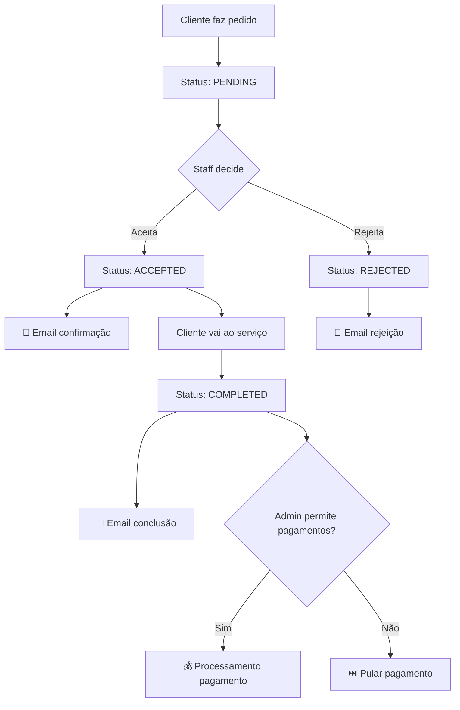

# 📧 Sistema de Notificações e Pagamentos Automáticos

## Visão Geral

O sistema agora inclui automação completa para notificações por email e processamento de pagamentos quando os estados dos agendamentos mudam. **Os pagamentos podem ser ativados/desativados por conta através do portal admin**.

## ⚡ Automação Automática

Quando um agendamento muda de estado (PENDING → ACCEPTED/REJECTED, ACCEPTED → COMPLETED), o sistema automaticamente:

1. **Envia email personalizado** para o cliente
2. **Processa pagamento** (se configurado e ativado pelo admin)
3. **Regista logs** da atividade

## 🔐 Controlo Administrativo de Pagamentos

### Sistema Duplo de Controlo
- **Admin**: Ativa/desativa pagamentos por negócio no portal admin
- **Negócio**: Só pode ativar se o admin permitir

### Interface Admin
- **URL**: `/admin/businesses/{id}/payments`
- **Acesso**: Apenas utilizadores com role `ADMIN`
- **Funcionalidades**:
  - ✅ Ativar/desativar pagamentos por negócio
  - 📝 Notas administrativas internas
  - ⚙️ Configurar provedores de pagamento
  - 🧪 Testar conexões e simulações
  - 📊 Histórico de alterações

## 🎯 Endpoints Principais

### 1. Controlo Admin de Pagamentos

**GET** `/api/admin/businesses/[id]/payments`
```bash
curl "https://koobings.com/api/admin/businesses/123/payments" \
  -H "Authorization: Bearer ADMIN_TOKEN"
```

**PUT** `/api/admin/businesses/[id]/payments`
```json
{
  "adminEnabled": true,
  "adminNotes": "Pagamentos aprovados para este negócio",
  "provider": "stripe",
  "currency": "EUR",
  "processingFee": 2.9
}
```

**POST** `/api/admin/businesses/[id]/payments/test`
```json
{
  "action": "test_connection" // ou "simulate_payment"
}
```

### 2. Notificações de Agendamento

**Endpoint automático**: Já integrado no `PATCH /api/appointments/[id]`

**Endpoint manual**: `POST /api/appointments/[id]/notifications`

```json
{
  "status": "ACCEPTED",
  "sendEmail": true
}
```

**Resposta**:
```json
{
  "success": true,
  "data": {
    "emailSent": true,
    "paymentProcessed": false,
    "notifications": [
      "Email sent to cliente@email.com"
    ]
  }
}
```

### 3. Configurações de Notificações

**GET** `/api/business/notifications/settings`

Obtém configurações atuais do negócio (agora considera controlo admin).

**PUT** `/api/business/notifications/settings`

```json
{
  "emailEnabled": true,
  "smsEnabled": false,
  "paymentEnabled": true, // Só funciona se admin permitir
  "paymentProvider": "stripe",
  "emailTemplates": {
    "accepted": "Template personalizado...",
    "rejected": "Template personalizado...",
    "completed": "Template personalizado..."
  },
  "paymentSettings": {
    "currency": "EUR",
    "autoCharge": true,
    "depositPercentage": 20
  }
}
```

### 4. Histórico de Pagamentos

**GET** `/api/business/payments/history`

Query params:
- `limit=50` - Número de resultados
- `offset=0` - Paginação
- `status=completed` - Filtrar por estado
- `startDate=2025-01-01` - Data início
- `endDate=2025-12-31` - Data fim

## 🏢 Portal Admin - Gestão de Pagamentos

### Acesso
1. Login como admin em `/auth/admin-signin`
2. Ir para `/admin/businesses`
3. Selecionar negócio → Botão "Pagamentos"

### Funcionalidades Admin

#### ✅ Controlo Principal
- **Toggle ON/OFF**: Permitir/bloquear pagamentos
- **Notas internas**: Razão da decisão
- **Histórico**: Quem e quando alterou

#### ⚙️ Configurações Técnicas
- **Provedor**: Stripe, PayPal, MBWay
- **Moeda**: EUR, USD, etc.
- **Taxa de processamento**: % cobrada
- **Depósito**: % pago antecipadamente
- **Cobrança automática**: Sim/Não

#### 🧪 Testes
- **Testar Conexão**: Verifica se provedor está configurado
- **Simular Pagamento**: Processa transação de teste

### Lógica de Controlo

```
Admin OFF + Negócio OFF = ❌ Pagamentos desativados
Admin OFF + Negócio ON  = ❌ Pagamentos desativados  
Admin ON  + Negócio OFF = ❌ Pagamentos desativados
Admin ON  + Negócio ON  = ✅ Pagamentos ativados
```

## 📧 Templates de Email

### ✅ Agendamento Aceite
- **Assunto**: "✅ Agendamento Confirmado - [Serviço]"
- **Conteúdo**: Detalhes do agendamento, data, hora, local
- **Cor**: Verde (#10b981)

### ❌ Agendamento Rejeitado
- **Assunto**: "❌ Agendamento Não Disponível - [Serviço]"
- **Conteúdo**: Motivos possíveis, instruções para reagendar
- **Cor**: Vermelho (#ef4444)

### 🏆 Serviço Concluído
- **Assunto**: "🏆 Serviço Concluído - [Serviço]"
- **Conteúdo**: Agradecimento, pedido de feedback
- **Cor**: Verde (#10b981)

## 💰 Processamento de Pagamentos

### Automático
- Ativado quando agendamento fica **COMPLETED**
- Usa preço definido no serviço
- **Requer aprovação admin + configuração negócio**

### Manual
- Pode ser processado via API
- Permite override de valor e descrição
- Histórico completo mantido

## 🔧 Configuração

### 1. Admin - Ativar Pagamentos para Negócio

```bash
curl -X PUT "https://koobings.com/api/admin/businesses/123/payments" \
  -H "Authorization: Bearer ADMIN_TOKEN" \
  -d '{
    "adminEnabled": true,
    "adminNotes": "Aprovado para processar pagamentos",
    "provider": "stripe"
  }'
```

### 2. Negócio - Ativar Suas Configurações

```bash
curl -X PUT "https://koobings.com/api/business/notifications/settings" \
  -H "Authorization: Bearer BUSINESS_TOKEN" \
  -d '{
    "emailEnabled": true,
    "paymentEnabled": true,
    "paymentProvider": "stripe"
  }'
```

### 3. Testar Sistema

```bash
curl -X POST "https://koobings.com/api/admin/businesses/123/payments/test" \
  -H "Authorization: Bearer ADMIN_TOKEN" \
  -d '{"action": "simulate_payment"}'
```

## 🚀 Fluxo Completo



## ⚠️ Notas Importantes

1. **Duplo Controlo**: Admin deve ativar + Negócio deve configurar
2. **Simulação**: Atualmente em modo simulação - emails e pagamentos são mockados
3. **Logs**: Toda atividade fica registada nos logs do servidor
4. **Falhas**: Falhas nas notificações não impedem mudança de estado
5. **Performance**: Notificações são assíncronas (não bloqueiam)
6. **Segurança**: Apenas admins podem ativar/desativar pagamentos

## 🔌 Integração Real

Para produção, substitua as funções de simulação por:

- **Email**: SendGrid, Resend, Amazon SES
- **Pagamentos**: Stripe, PayPal, MBWay API
- **SMS**: Twilio, Nexmo
- **Logs**: Winston, Datadog

## 📊 Exemplo de Resposta Admin

```json
{
  "success": true,
  "data": {
    "business": {
      "id": "biz_123",
      "name": "Clínica Exemplo",
      "slug": "clinica-exemplo"
    },
    "paymentSettings": {
      "enabled": false,
      "adminEnabled": true,
      "provider": "stripe",
      "currency": "EUR",
      "adminNotes": "Aprovado para pagamentos",
      "lastUpdatedBy": "admin@koobings.com",
      "lastUpdatedAt": "2025-01-17T10:30:00Z"
    }
  }
}
```

---

✅ **Sistema com controlo administrativo total deployado em koobings.com** 